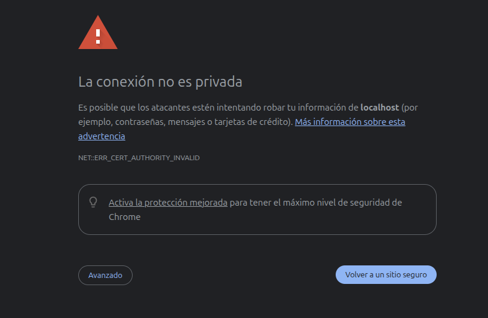
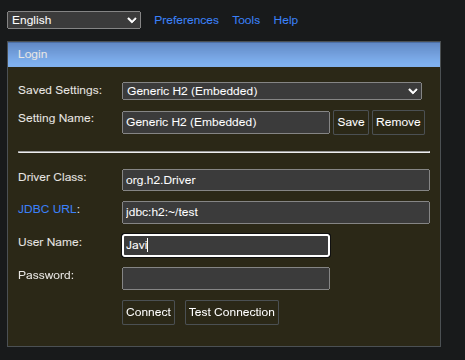
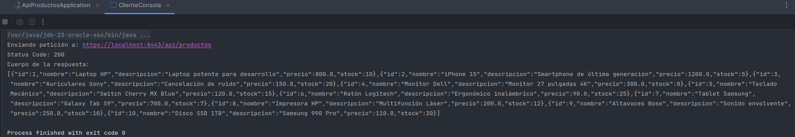

# API de Gestión de Productos

Este proyecto implementa una API REST completa para la gestión de productos, incorporando medidas avanzadas de seguridad (HTTPS, Autenticación) y calidad de código (Validaciones, Arquitectura en Capas), cumpliendo con los requisitos de **RA4** y **RA5**.

## Tecnologías Utilizadas

- **Java 21**: Lenguaje principal.
- **Spring Boot 3.x**: Framework para el desarrollo de la aplicación (Web, Security, Data JPA, Validation).
- **H2 Database**: Base de datos en memoria para persistencia ágil.
- **Maven**: Gestión de dependencias y construcción.
- **BCrypt**: Criptografía para almacenamiento seguro de contraseñas.

## Ejecución y Acceso Seguro

La aplicación está configurada para ejecutarse sobre **HTTPS** en el puerto **8443**.

1. **Compilar y Ejecutar**:
   ```bash
   mvn spring-boot:run
   ```

2. **Acceso desde el Navegador**:
   - URL Base: `https://localhost:8443`
   - *Nota*: Al usar un certificado autofirmado, el navegador mostrará una advertencia de seguridad. Debes aceptarla para continuar.



## Endpoints de la API

| Método | URL                   | Descripción          | Acceso       | Body JSON Ejemplo |
|--------|-----------------------|----------------------|--------------|-------------------|
| GET    | `/api/productos`      | Listar todos         | **Público**  | N/A |
| GET    | `/api/productos/{id}` | Obtener detalle      | **Público**  | N/A |
| POST   | `/api/productos`      | Crear producto       | **Admin**    | `{"nombre": "Laptop", "precio": 1200.50, "stock": 5}` |
| PUT    | `/api/productos/{id}` | Actualizar producto  | **Admin**    | `{"nombre": "Laptop Pro", "precio": 1300.00, "stock": 2}` |
| DELETE | `/api/productos/{id}` | Eliminar producto    | **Admin**    | N/A |

## Bases de Datos `H2`

La consola de administración de base de datos también se sirve sobre HTTPS.

- **URL**: `https://localhost:8443/h2-console`
- **JDBC URL**: `jdbc:h2:mem:testdb`
- **User Name**: `Javi`
- **Password**: *(vacío)*

> ****

## Seguridad y Validación (RA5)

### Autenticación y Autorización
El sistema implementa **HTTP Basic Auth** para proteger los recursos sensibles.

- **Credenciales de Administrador**:
  - Usuario: `admin`
  - Contraseña: `admin123`
- **Modelo de Control de Acceso (RBAC)**:
  - **Lectura (GET)**: Abierto a cualquier usuario (incluso anónimos).
  - **Escritura (POST, PUT, DELETE)**: Restringido estrictamente a usuarios autenticados con rol `ADMIN`.

### Validación de Datos
Para garantizar la integridad de la información, se aplican validaciones estrictas (`@Valid`) en la capa de entrada:
- **Nombre**: Obligatorio (`@NotBlank`).
- **Precio**: Debe ser positivo (`@Positive`).
- **Stock**: No puede ser negativo (`@Min(0)`).

*Si se viola alguna regla, la API retorna un error `400 Bad Request`.*

## Anexo Técnico: Cobertura de Criterios Avanzados

### 1. Criptografía Robusta (RA5)
En lugar de almacenar credencialeZs en texto plano (como `{noop}`), se utiliza **BCryptPasswordEncoder**.
- Este algoritmo aplica **hashing unidireccional** con *salt* automático.
- Protege eficazmente contra ataques de diccionario y *rainbow tables*.
- Implementado en la clase `SecurityConfig.java`.

### 2. Cliente Java Programado (RA4)
Se incluye un cliente de consola independiente para demostrar la capacidad de consumir servicios seguros programáticamente.
- **Clase**: `com.ejemplo.api.client.ClienteConsola`
- **Tecnología**: Usa la API nativa `java.net.http.HttpClient` (Java 11+).
- **Funcionamiento**: Construye manualmente la cabecera `Authorization` codificando las credenciales en Base64 y realiza una petición GET segura.




### 3. Concurrencia y Sockets (RA4)
La aplicación maneja la concurrencia delegando la gestión de **Sockets** y **Hilos** al contenedor embebido (Apache Tomcat).
- **Pool de Hilos**: Tomcat mantiene un pool de hilos de trabajo (`nio-8443-exec-*`).
- **Multitarea**: Cada petición HTTP entrante se asigna a un hilo libre del pool, permitiendo que la API atienda múltiples solicitudes de clientes simultáneamente sin bloqueos, aprovechando los núcleos del procesador.
